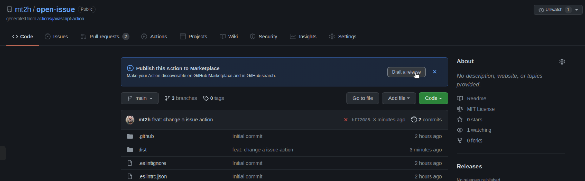

# GitHub Actions

This project is the continuation of https://github.com/mt2h/github-actions-course of course Github Actions

also 

https://github.com/mt2h/react-app
course Github Actions

## Public Personal Actions


```bash
cd javascript-action
npm install
npm install '@actions/core@^1.1.1'
npm install '@actions/github@^2.1.0'
npm install '@zeit/ncc@0.20.5'
npm install 'eslint@^6.3.0'
npm install 'jest@^24.9.0'
npm test

sudo apt install eslint
npm run package
```

## Template


## Publish Action to Marketplace

